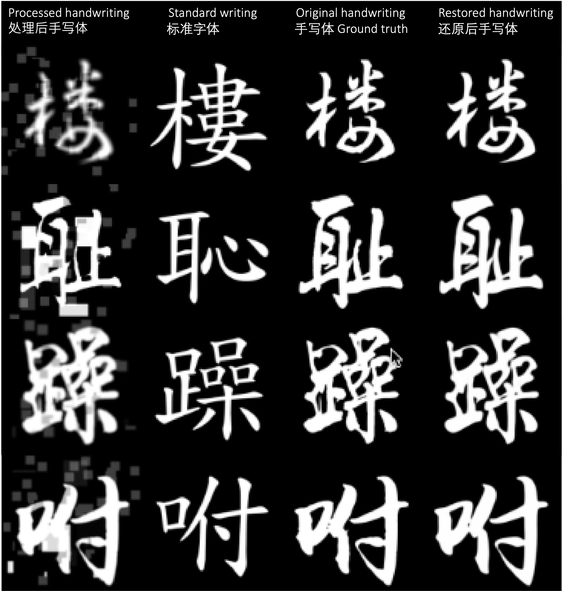
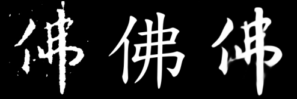

# RestoreAE-Zi

Autoencoders for denoising and restoration purpose. Here they are used to restore inscriptions and writings (Zi) from damages with and without standard font as reference. You can find more fun background information at the end of this document.

The CNN-based network architectures here are customized based on [MobileNetV3](https://arxiv.org/abs/1905.02244), [EfficientNetV2](https://arxiv.org/abs/2104.00298), and [ConvNeXt](https://arxiv.org/abs/2201.03545). These three autoencoder architectures here are designed to be sysmetric so that the encoder and decoder have similar capability. The autoencoder based on MobileNetV3/EfficientNetV2/ConvNeXt-T has around 4.5M//51M parameters respectively. The latent space dimension is 512 by default. Asymmetric autoencoder is also popular: ablation studies have shown asysmetric autoencoders can provide state-of-art accuracy and at the same time gain extra benefits in throughput and parameter efficiency. I am also actively exploring asymetric models.

The transformer-based architecture here is based on [ViT](https://arxiv.org/abs/2010.11929) and [Masked Autoencoders](https://arxiv.org/abs/2111.06377). Instead of masking a large portion of patches as in the Masked Autoencoder work, a group of painting methods are used here to mimic damages on inscriptions and writings.

In the initial design, the input of autoencoder is class-informed by providing an additional 'standard font' channel along with inscription or writing grey-scale images, and the output is grey-scale images after restoration. The 'standard font' here can provide additional information about the inscrption or writing in the restoration given the fact that corresponding characters (writings in standard font) are also usually known before restoration. Providing inscrption images only (without standard font) as the input also has unique advantages. First, it enables pretraining on more public datasets, such as ImageNet etc. Second, the 'standard' font itself also changes over time and can vary, which might bring inconsistency in some cases.

This work is mostly for demo purpose. More comprehensive data preparation and ablation studies wait to be done to improve generalization and explore the complexity-performance trade-off. 

Environment: Python3.9 + requirements.txt 

## 1. Results

Here are a few examples of restored handwriting images. The left two columns (painted and standard writings) are the input of the neural network; the third column is the ground truth; and the last column is the restoration result given by the neural network. 

## 2. Training

The checkpoint file is available here, [MobileNet](), [ConvNext](https://drive.google.com/file/d/1m8e-eeI0zy6sOcmC2_Z1ooOk1Wlz6gwu/view?usp=sharing), [ViT](). The [dataset](https://drive.google.com/file/d/15_tXRqRtOpTFuoFpXNOtbrBWic0IqzRg/view?usp=sharing) contains 12 hand writings for each of the 3751 characters (Zi). This dataset will be further expanded in future efforts.

For data augmentation, each input image goes through a random collection of image processing methods, including erosion and dilation, random rectangle painting, blurring, and random noise. 
  

## 3. Testing

Check out visualization/restore_eval.ipynb for restoration results.

## 0. Fun Project Background
Ancient inscriptions, spanning hundreds or even thousands of years, often bear the marks of additional noise and defects resulting from natural erosion or deliberate damage. This is part of my efforts to restore ancient inscriptions and hand writings employing machine learning techniques. As an example, the left panel is the digitized image of a character (Zi) cropped from an inscription (普觉国师碑). The historical inscription dates back to approximately the year of 1289 during the Southern Song Dynasty and is featured by the calligraphy style of Xizhi Wang (王羲之集字). The middle panel is the contemporary standard writing, and the right one is the restored version generated from the digitized inscription using this neural network.

